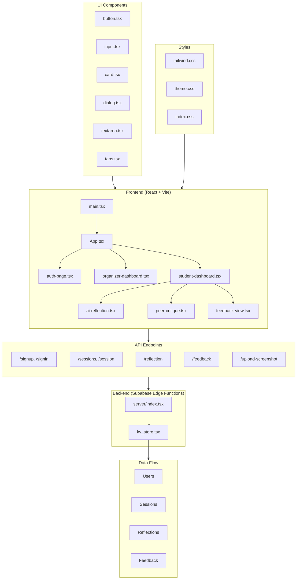

# Prompt Crit - Claude Development Guide

## Overview

Prompt Crit is a peer critique platform for creative projects built for Wharton Gen AI Studio. It facilitates structured feedback cycles where students reflect on their creative work through AI-guided conversations, provide constructive feedback to peers, and receive feedback on their own projects.

## User Flow Diagram

```mermaid
flowchart LR
    A["Visit App"] --> B["Sign In / Sign Up"]
    B --> C{"Select Role"}

    C -->|"Organizer"| D["Organizer Dashboard"]
    D --> E["Create New Session"]
    E --> F["Manage Student Roster"]
    F --> G["Start Crit Session"]
    G --> H["Monitor Progress"]
    H --> I["View Completion Metrics"]

    C -->|"Student"| J["Student Dashboard"]
    J --> K["Select Active Session"]
    K --> L["AI-Guided Reflection"]
    L --> M["Answer 5 Core Questions"]
    M --> N["Upload 3 Screenshots"]
    N --> O["Write Project Summary"]
    O --> P["Complete Reflection"]
    P --> Q["View Peer Projects"]
    Q --> R["Provide Feedback"]
    R --> S{"More Peers?"}
    S -->|"Yes"| Q
    S -->|"No"| T["View My Feedback"]
    T --> U["Session Complete"]

    G -.->|"Enables"| K
    I -.->|"Tracks"| P
    I -.->|"Tracks"| T
```



## Session Phases

| Phase | Status | Who Sees | Actions Available |
|-------|--------|----------|-------------------|
| Setup | `setup` | Organizer only | Manage Roster, Start Crit |
| Reflection | `reflection` | Students | Complete AI Reflection |
| Critique | `critique` | Students | Provide Peer Feedback |
| Complete | `complete` | Both | View Results/Archive |

## Key User Journeys

### Organizer Journey
1. Login → Dashboard → Create Session → Add Students → Start Crit → Monitor Progress

### Student Journey
1. Login → Dashboard → Select Session
2. **Reflection Phase**: AI asks 5 questions → Upload screenshots → Write summary
3. **Critique Phase**: View peer projects → Provide feedback (loop for each peer)
4. **Review Phase**: Read feedback received → Reflect on suggestions

## AI Reflection Questions

The AI guides students through 5 core questions:
1. What did you build and what motivated you?
2. What emotions do you hope people feel?
3. What insights did you gather?
4. What did you learn about subject/self?
5. What questions remain? What would you explore next?

## Codebase Architecture



## Directory Structure

```
berghaus/
├── src/
│   ├── main.tsx                 # App entry point
│   ├── app/
│   │   ├── App.tsx              # Main app with routing/auth
│   │   └── components/
│   │       ├── auth-page.tsx        # Login/signup
│   │       ├── organizer-dashboard.tsx  # Session management
│   │       ├── student-dashboard.tsx    # Student hub
│   │       ├── ai-reflection.tsx        # AI conversation
│   │       ├── peer-critique.tsx        # Feedback carousel
│   │       ├── feedback-view.tsx        # View received feedback
│   │       └── ui/                      # Reusable UI components
│   ├── styles/
│   │   ├── index.css
│   │   ├── tailwind.css
│   │   └── theme.css
│   └── utils/
│       └── supabase/client.ts   # Supabase client
├── supabase/
│   └── functions/server/
│       ├── index.tsx            # API routes
│       └── kv_store.tsx         # Data persistence
└── config files (package.json, vite.config.ts, etc.)
```

## Tech Stack

- **Frontend**: React + TypeScript + Vite
- **Styling**: Tailwind CSS
- **Backend**: Supabase Edge Functions
- **Database**: Supabase (KV Store)

## Development Commands

```bash
npm install      # Install dependencies
npm run dev      # Start development server
npm run build    # Build for production
```
